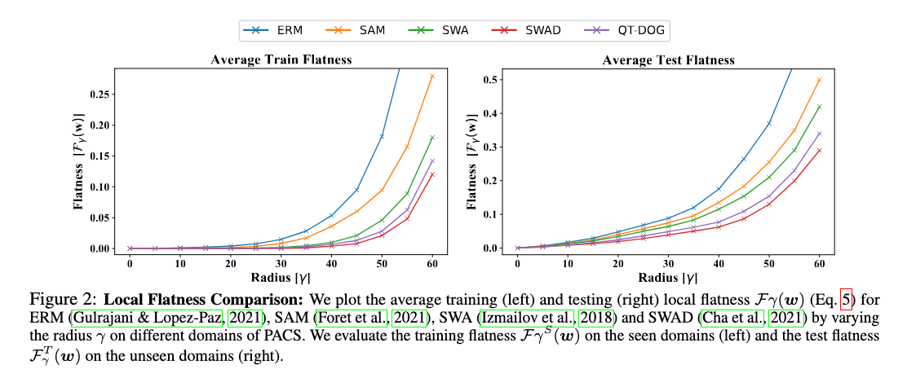

# QT-DOG: QUANTIZATION-AWARE TRAINING FOR DOMAIN GENERALIZATION

> [Saqib Javed](https://saqibjaved1.github.io/), [Hieu Le](https://hieulem.github.io/), [Mathieu Salzmann](https://scholar.google.com/citations?user=n-B0jr4AAAAJ&hl=en)

[](https://saqibjaved1.github.io/QT_DoG/)
[](https://arxiv.org/abs/2410.06020)

QT-DoG enhances domain generalization by utilizing quantization to promote flatter minima in the loss landscape, which reduces overfitting to source domains and improves performance on unseen data. It significantly reduces model size and computational overhead without sacrificing accuracy, making it resource-efficient and suitable for real-world applications. Additionally, QT-DoG generalizes across various datasets, architectures, and quantization algorithms, and can be seamlessly combined with other domain generalization techniques, demonstrating its robustness and adaptability.

## Citation
If you find our work useful. Please consider giving a star :star: and a citation.
```bibtex
@misc{javed2024qtdogquantizationawaretrainingdomain,
      title={QT-DoG: Quantization-aware Training for Domain Generalization},
      author={Saqib Javed and Hieu Le and Mathieu Salzmann},
      year={2024},
      archivePrefix={arXiv},
      url={https://arxiv.org/abs/2410.06020},
}
```


## Preparation

### Dependencies

```sh
pip install -r requirements.txt
```

### Datasets

```sh
python -m domainbed.scripts.download --data_dir=/my/datasets/path
```
### Environment
Environment details used for our study.


```sh
	Python: 3.8.10
	PyTorch: 1.10.1+cu113
	Torchvision: 0.11.2+cu113
	CUDA: 11.3
	CUDNN: 8200
	NumPy: 1.19.4
	PIL: 8.1.0
```

## How to Run

`train_all.py` script conducts multiple leave-one-out cross-validations for all target domain.

```sh
python train_all.py exp_name --dataset PACS --data_dir /my/datasets/path --quant 1 --q_steps 100 
```

Example results on PACS with ResNet-50:

| Algorithm        |   Art | Cartoon | Painting | Sketch | Avg.  |**Size** | **Models trained** |
|------------------|-------|---------|----------|--------|-------|---------|-----------------|
| **ERM (our runs)** |  89.8 |   79.7  |   96.8   |  72.5  | 84.7  |1x|  1
| **SWAD**         |  89.3 |   83.4  |   97.3   |  82.5  | 88.1  |1x| 1 |
| **EoA**          |  90.5 |   83.4  |   98.0   |  82.5  | 88.6  |6x| 6|
| **DiWA**         |  90.6 |   83.4  | **98.2** |  83.8  | 89.0  |1x| 60|
| **QT-DoG**       |  89.1 |   82.4  |   96.9   |  82.3  | 87.8  | 0.22x | 1 |
| **EoQ**          | **90.7** | **83.7** | **98.2** | **84.8** | **89.3** | 1x | 5|


In this example, QT-DoG achieves a Domain Generalization (DG) performance of 87.8% on the PACS dataset. However, when ensembling using the same method as Ensemble of Averages (EoA), our EOQ approach achieves state-of-the-art results, despite being more compact in size.


##  Results

###  Quantizing Vision Transformers

Comparison of performance on PACS and TerraInc datasets with and without QT-DoG quantization of [ERM_ViT](https://openaccess.thecvf.com/content/ACCV2022/papers/Sultana_Self-Distilled_Vision_Transformer_for_Domain_Generalization_ACCV_2022_paper.pdf) using the DeiT-Small backbone.

| **Algorithm**           | **Backbone**    | **PACS**            | **TerraInc**        | **Compression** |
|-------------------------|-----------------|---------------------|---------------------|-----------------|
| **ERM_ViT**             | DeiT-Small      | 84.3 ± 0.2          | 43.2 ± 0.2          | -               |
| **ERM-SD_ViT**          | DeiT-Small      | **86.3 ± 0.2**       | 44.3 ± 0.2          | -               |
| **ERM_ViT + QT-DoG**    | DeiT-Small      | 86.2 ± 0.3          | **45.6 ± 0.4**       | **4.6x**        |

###  Combination with other methods

Results of PACS and Terra Incognita datasets incorporating QT-DoG with CORAL and MixStyle. "C" represents the compression factor of the model.


| **Algorithm**        | **PACS**           | **TerraInc**        | **C**      |
|----------------------|--------------------|---------------------|------------|
| **CORAL**            | 85.5 ± 0.6         | 47.1 ± 0.2          | -          |
| **CORAL + QT-DoG**   | **86.9 ± 0.2**      | **50.6 ± 0.3**       | 4.6x       |
| **MixStyle**         | 85.2 ± 0.3         | 44.0 ± 0.4          | -          |
| **MixStyle + QT-DoG**| **86.8 ± 0.3**      | **47.7 ± 0.2**       | 4.6x       |

## Main Results

<p align="center">
    
</p>

##  Flatness Plots

We used the same method as [SWAD](https://github.com/khanrc/swad/tree/main/visualization) to plot the loss flatness. Below are the local loss flatness plots for QT-DoG along with other methods.

<p align="center">
    
</p>

### Acknowledgements
Our code is based on [SWAD](https://github.com/khanrc/swad/tree/main) and [LSQ](https://github.com/zhutmost/lsq-net) repository. We thank the authors for releasing their code. 


